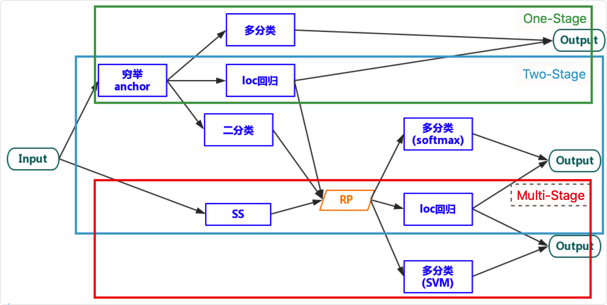

[toc]
# 构成
## 训练
### Epoch
### Batch
Batch_Size（批尺寸）是机器学习中一个重要参数。Batch 的选择，首先决定的是下降的方向。
如果数据集比较小，完全可以采用全数据集 (Full Batch Learning) 的形式，这样做至少有 2 个好处：
+ 由全数据集确定的方向能够更好地代表样本总体，从而更准确地朝向极值所在的方向。
+ 由于不同权重的梯度值差别巨大，因此选取一个全局的学习率很困难。 Full Batch Learning 可以使用 Rprop 只基于梯度符号并且针对性单独更新各权值。

对于更大的数据集，以上 2 个好处又变成了 2 个坏处：
+ 随着数据集的海量增长和内存限制，一次性载入所有的数据进来变得越来越不可行。
+ 以 Rprop 的方式迭代，会由于各个 Batch 之间的采样差异性，各次梯度修正值相互抵消，无法修正。这才有了后来 RMSProp 的妥协方案。

既然 Full Batch Learning 并不适用大数据集，那么走向另一个极端怎么样？所谓另一个极端，就是每次只训练一个样本，即 Batch_Size = 1。即在线学习 (Online Learning)。
线性神经元在均方误差代价函数的错误面是一个抛物面，横截面是椭圆。对于多层神经元、非线性网络，在局部依然近似是抛物面。使用在线学习，每次修正方向以各自样本的梯度方向修正，横冲直撞各自为政，难以达到收敛。

可不可以选择一个适中的 Batch_Size 值呢？
当然可以，这就是批梯度下降法（Mini-batches Learning）。因为如果数据集足够充分，那么用一半（甚至少得多）的数据训练算出来的梯度与用全部数据训练出来的梯度是几乎一样的。
引用元：https://blog.csdn.net/ycheng_sjtu/article/details/49804041

### Iteration
基本概念：
Epoch：使用训练集的全部数据对模型进行一次完整训练，被称之为“一代训练”；或一整次完全训练
Batch：使用训练集中的一小部分样本对模型权重进行一次反向传播的参数更新，这一小部分样本被称为“一批数据”；
Literation：使用一个 Batch 数据对模型进行一次参数更新的过程，被称之为“一次训练”
换算关系：
$$\text{Number of Batches}=\frac{\text { TrainingSet Size }}{\text{Batch Size}}$$
实际上，梯度下降的几种方式的根本区别就在于上面公式中的 Batch Size 不同。

| 梯度下降方式 | TrainingSet Size | Batch Size | Number of Batches |
| --- | --- | --- | --- |
| BGD | $N$ | $N$ | $1$ |
| SGD | $N$ | $1$ | $N$ |
| Mini-Batch | $N$ | $B$ | $\frac{N}{B+1}$ |

注：上表中 Mini-Batch 的 Batch 个数为 $\frac{N}{B+1}$ 是针对未整除的情况。整除则是 $\frac{N}{B}$。

e.g. CIFAR10 数据集有 50000 张训练图片，10000 张测试图片。现在选择 Batch Size = 256 对模型进行训练。
1. 每代 Epoch 要训练的图片数量：$50000$
2. 训练集具有的 Batch 个数：$50000 / 256 \approx 195+1=196$
3. 每个 Epoch 需要完成的 Batch 个数：$196$
4. 每个 Epoch 具有的 Iteration 个数：$196$
5. 每个 Epoch 中发生模型权重更新的次数：$196$
6. 训练 10 代后，模型权重更新的次数：$196\times10=1960$
7. 不同代的训练，其实用的是同一个训练集的数据。第 1 代和第 10 代虽然用的都是训练集的全部图片，但是对模型的权重更新值却是完全不同的。因为不同代的模型处于代价函数空间上的不同位置，模型的训练代越靠后，越接近谷底，其代价越小。
https://www.jianshu.com/p/22c50ded4cf7


# 传统神经网络
## 激励函数
### sigmoid 与 softmax 函数[^BCEloss]
[^BCEloss]: [多标签分类与BCEloss](https://www.jianshu.com/p/ac3bec3dde3e)
#### sigmoid 函数
$$S(x)=\frac{1}{1+e^{-x}}$$

**把线性的输入转换为非线性的输出**
Sigmoid 是一个可微的有界函数，在各点均有非负的导数。
当 $x \rightarrow \infty$ 时，$S(x) \rightarrow 1$; 
当 $x \rightarrow -\infty$ 时，$S(x) \rightarrow 0$。
常用于二元分类（Binary Classification）问题，以及神经网络的激活函数（Activation Function）。
#### softmax 函数
$$S\left(x_{j}\right)=\frac{e^{x_{j}}}{\sum_{k=1}^{K} e^{x_{k}}}, j=1,2, \ldots, K$$
对于一个长度为 $K$ 的任意实数矢量，Softmax 可以把它压缩为一个长度为 $K$ 的、取值在 $(0, 1)$ 区间的实数矢量，且矢量中各元素之和为 1。它在多元分类（Multiclass Classification）和神经网络中也有很多应用。
Softmax 不同于普通的 max 函数：max 函数只输出最大的那个值，而 Softmax 则确保较小的值也有较小的概率，不会被直接舍弃掉，是一个比较“Soft“的“max”。
```python
nn.Softmax(dim=0) #每一行加和为0
nn.Softmax(dim=1) #每一行加和为1
```
#### 重要区别
`Sigmoid` + `互信息` 输出结果是伯努利分布。即：$P\left(y_{1} | X\right), P\left(y_{2} | X\right), \ldots, P\left(y_{n} | X\right)$ 。Sigmoid 输出结果的和并不为 1。结果只代表在该位取得最大值结果的可能性。
Softmax 输出的是多项分布：$P\left(y_{1}, y_{2}, \ldots, y_{n} | X\right)$ e.g. 二分类时，输出结果的和相加为 1。

| 分类问题名称 | 输出层使用激活函数 | 对应的损失函数 |
| --- | --- | --- | --- |
| 二分类 | Sigmoid | 二分类交叉熵损失函数<br>Binary Cross Entropy |
| 多分类 | Softmax | 多类别交叉熵损失函数<br>Categorical Cross Entropy |
| 多标签分类 | Sigmoid | 二分类交叉熵损失函数<br>Binary Cross Entropy |

## [损失/目标]函数
Cost/Loss(Min) Objective(Max) Functions

单标签 Loss：在对图片进行单标签 $N$ 分类时，输入了$m$ 张图片，将会输出一个 $m*N$ 的Tensor。e.g. 输入3图片分3类时，将输出 $3*3$ 的Tensor.

多标签分类：...

### Negative Log-Likelihood Loss[^softmaxandCEL]

#### 似然函数 (likelihood function)

https://blog.csdn.net/silver1225/article/details/88914652

```python
loss = NLLLoss()
loss(data, target)
```

最大似然 / log似然代价函数
在对输出 Tensor 使用 Softmax函数 后，输出 Tensor 的各个值会位于 $0~1$ 之间。取 ln 之后取绝对值，使其区间落在 $[0, +∞)$。
取每行对应正确图像的概率取值，并求平均。

[^softmaxandCEL]: [Pytorch详解NLLLoss和CrossEntropyLoss](https://blog.csdn.net/qq_22210253/article/details/85229988)

### Cross Entropy Loss

把以上 Softmax–Log–NLLLoss 合成一步。

```python
loss = nn.CrossEntropyLoss()
loss(data, target)
```


### 最大似然估计
1. Many cost functions are the result of applying Maximum Likelihood. For instance, the Least Squares cost function can be obtained via Maximum Likelihood. Cross-Entropy is another example.

2. The likelihood of a parameter value (or vector of parameter values), $θ$, given outcomes $x$, is equal to the probability (density) assumed for those observed outcomes given those parameter values, that is $$\mathcal{L}(\theta | x)=P(x | \theta)$$

3. The natural logarithm of the likelihood function, called the log-likelihood, is more convenient to work with. Because the logarithm is a monotonically increasing function, the logarithm of a function achieves its maximum value at the same points as the function itself, and hence the log-likelihood can be used in place of the likelihood in maximum likelihood estimation and related techniques.

4. In general, for a fixed set of data and underlying statistical model, the method of maximum likelihood selects the set of values of the model parameters that maximizes the likelihood function. Intuitively, this maximizes the "agreement" of the selected model with the observed data, and for discrete random variables it indeed maximizes the probability of the observed data under the resulting distribution. Maximum-likelihood estimation gives a unified approach to estimation, which is well-defined in the case of the normal distribution and many other problems.
$$f\left(x_{1}, x_{2}, \ldots, x_{n} | \theta\right)=f\left(x_{1} | \theta\right) \times f\left(x_{2} | \theta\right) \times \cdots \times f\left(x_{n} | \theta\right)$$

$$\mathcal{L}\left(\theta ; x_{1}, \ldots, x_{n}\right)=f\left(x_{1}, x_{2}, \ldots, x_{n} | \theta\right)=\prod_{i=1}^{n} f\left(x_{i} | \theta\right)$$

$$\ln \mathcal{L}\left(\theta ; x_{1}, \ldots, x_{n}\right)=\sum_{i=1}^{n} \ln f\left(x_{i} | \theta\right)$$

$$\hat{\ell}(\theta ; x)=\frac{1}{n} \sum_{i=1}^{n} \ln f\left(x_{i} | \theta\right)$$

$$\left\{\hat{\theta}_{\text {mle}}\right\} \subseteq\left\{\underset{\theta \in \Theta}{\arg \max} \hat{\ell}\left(\theta ; x_{1}, \ldots, x_{n}\right)\right\}$$

### 交叉熵 (Cross-Entropy) [A-a-2]
Cross entropy can be used to define the loss function in machine learning and optimization. The true probability $p_i$ is the true label, and the given distribution $q_i$ is the predicted value of the current model.

$$\begin{aligned}
&H(p, q)=\mathrm{E}_{p}\left[l_{i}\right]=\mathrm{E}_{p}\left[\log \frac{1}{q\left(x_{i}\right)}\right]\\
&H(p, q)=\sum_{x_{i}} p\left(x_{i}\right) \log \frac{1}{q\left(x_{i}\right)}\\
&H(p, q)=-\sum_{x} p(x) \log q(x)
\end{aligned}
$$
Cross-entropy error function and logistic regression
$$
L(\mathbf{w})=\frac{1}{N} \sum_{n=1}^{N} H\left(p_{n}, q_{n}\right)=-\frac{1}{N} \sum_{n=1}^{N}\left[y_{n} \log \hat{y}_{n}+\left(1-y_{n}\right) \log \left(1-\hat{y}_{n}\right)\right]
$$


### Binary Cross Entropy Loss
### Binary Cross Entropy with Logits Loss
```python
nn.BCEWithLogitsLoss
```
BCEWithLogitsLoss 就是把 Sigmoid-BCELoss合成一步。
BCEWithLogitsLoss = Sigmoid + BCELoss
常用于二分类问题，当然也可以用于多分类问题，通常需要在网络的最后一层添加sigmoid进行配合使用，其期望输出值（target）需要进行one hot编码，另外BCELoss还可以用于多分类问题Multi-label classification。
$$-\frac{1}{n} \sum\left(y_{n} \times \ln x_{n}+\left(1-y_{n}\right) \times \ln \left(1-x_{n}\right)\right)$$
其中 $y$ 是target，$x$ 是模型输出的值。

```python
loss = nn.BCELoss()
loss(input, target)
```


## 最优化
深度学习的优化算法主要有 `GD` , `SGD` , `Momentum`, `RMSProp` 和 `Adam` 算法

### 反向传播
```python
loss.backward()
```
https://blog.csdn.net/u014303046/article/details/78200010
https://www.jianshu.com/p/6ab6f53874f7

#### 链式法则

##### 梯度消失及梯度爆炸💥问题

**梯度爆炸问题**和**梯度消失问题** (Gradient vanishing and gradient exploding problem)一般随着网络层数的增加会变得越来越明显。

例如，对于下面一个含有3个隐藏层的神经网络（`HDL1`, `HDL2`, `HDL3`）
`INT` -> `HDL1` -> `HDL2` -> `HDL3` -> `OUT`
当**梯度消失问题**发生时，接近于输出层(`OUT`)的`HDL3`及`HDL2`的权值更新相对正常，但接近于输出层(`INT`)的`HDL1`的权值更新会变得很慢，<u>以至于这些层权值没有发生显著改变，接近于初始化的权值</u>，导致前面的层只对所有的输入做了一个同一映射（即映射层）。也解释了为何更深层的神经网络的学习结果仅等价于后几层浅层网络的学习。

**梯度消失问题产生的具体过程**
以下图的反向传播为例（假设每一层只有一个神经元且对于每一层$y_{i}=\sigma\left(z_{i}\right)=\sigma\left(w_{i} x_{i}+b_{i}\right)$，其中 $\sigma$ 为sigmoid函数）
`START` --> `b1` -$w_2$-> `b2` -$w_3$-> `b3` -$w_4$-> `b4` --> `C`
$$\begin{aligned}
\frac{\partial C}{\partial b_{1}} &=\frac{\partial C}{\partial y_{4}} \frac{\partial y_{4}}{\partial z_{4}} \frac{\partial z_{4}}{\partial x_{4}} \frac{\partial x_{4}}{\partial z_{3}} \frac{\partial z_{3}}{\partial x_{3}} \frac{\partial x_{3}}{\partial z_{2}} \frac{\partial z_{2}}{\partial x_{2}} \frac{\partial x_{2}}{\partial z_{1}} \frac{\partial z_{1}}{\partial b_{1}} \\
&=\frac{\partial C}{\partial y_{4}} \sigma^{\prime}\left(z_{4}\right) w_{4} \sigma^{\prime}\left(z_{3}\right) w_{3} \sigma^{\prime}\left(z_{2}\right) w_{2} \sigma^{\prime}\left(z_{1}\right)
\end{aligned}$$

根据 $\sigma^{\prime}(x)$ 函数在定义域 $[-5,5]$ 图像可知。$\sigma^{\prime}(x)$ 的最大值为 $\frac{1}{4}$，而我们初始化的网络权值 $|w|$ 通常都小于1，因此 $\left|\sigma^{\prime}(z) w\right| \leq \frac{1}{4}$，因此对于上面的链式求导，层数越多，求导结果 $\frac{\partial C}{\partial b_{1}}$ 越小，因而导致梯度消失的情况出现。

这样，梯度爆炸问题的出现原因就显而易见了，即 $\left|\sigma^{\prime}(z) w\right|>1$，也就是 $\sigma^{\prime}(z)$ 比较大的情况。但对于使用sigmoid激活函数来说，这种情况比较少。因为 $\sigma^{\prime}(z)$ 的大小也与 $w$ 有关（$z=wx+b$），除非该层的输入值 $x$ 在一直一个比较小的范围内。

如果此部分大于1，那么层数增多的时候，最终的求出的梯度更新将以指数形式增加，即发生梯度爆炸，如果此部分小于1，那么随着层数增多，求出的梯度更新信息将会以指数形式衰减，即发生了梯度消失。
https://blog.csdn.net/qq_25737169/article/details/78847691

其实梯度爆炸和梯度消失问题都是因为网络太深，网络权值更新不稳定造成的，本质上是因为梯度反向传播中的连乘效应。对于更普遍的梯度消失问题，可以考虑用ReLU激活函数取代sigmoid激活函数。另外，LSTM的结构设计也可以改善RNN中的梯度消失问题。

https://zhuanlan.zhihu.com/p/25631496

### 优化器
#### 动量（Momentum）
mini-batch SGD 算法虽然有很快的训练速度，但结果并不总是全局最优。另外需要挑选合适的超参（学习率），不合适的超参会导致收敛速度过慢（震荡收敛？）或跳过最优区间。
Momentum基于梯度的移动指数加权平均，可以解决mini-batch SGD优化算法更新幅度摆动大的问题，同时可以使得网络的收敛速度更快。
假设在当前的迭代步骤第 $t$ 步中，那么基于Momentum优化算法可以写成下面的公式： 
$$\begin{array}{c}
v_{d w}=\beta v_{d w}+(1-\beta) d W \\
v_{d b}=\beta v_{d b}+(1-\beta) d b \\
W=W-\alpha v_{d w} \\
b=b-\alpha v_{d b}
\end{array}$$

其中，在上面的公式中 $v_{dw}$ 和 $v_{db}$ 分别是损失函数在前 $t−1$ 轮迭代过程中累积的梯度动量，$β$ 是梯度累积的一个指数，一般设置值为 $β=0.9$。$dW$ 和 $db$ 分别是损失函数反向传播时候所求得的梯度，下面两个公式是网络权重向量和偏置向量的更新公式，$α$ 是网络的学习率。
所以Momentum优化器的主要思想就是利用了类似与**指数加权移动平均法[^EWMA]**的方法来对网络的参数进行平滑处理的，让梯度的摆动幅度变得更小。 

* [ ] ???为什么

[^EWMA]: **指数加权移动平均法(EWMA)**：Exponentially weighted averages。根据同一个移动段内不同时间的数据对预测值的影响程度，分别给予不同的权数，然后再进行平均移动以预测未来值。加权移动平均法，是对观察值分别给予不同的权数，按不同权数求得移动平均值，并以最后的移动平均值为基础，确定预测值的方法。采用加权移动平均法，是因为观察期的近期观察值对预测值有较大影响，它更能反映近期变化的趋势。指数移动加权平均法，是指各数值的加权系数随时间呈指数式递减，越靠近当前时刻的数值加权系数就越大。指数移动加权平均较传统的平均法来说，一是不需要保存过去所有的数值；二是计算量显著减小。

#### RMSprop
在上面的Momentum优化算法中，虽然初步解决了损失函数在更新中存在的摆动幅度[^摆动幅度]过大问题。为了进一步优化，并且进一步加快函数的收敛速度，Geoffrey E. Hinton在Coursera课程中提出的一种新的优化算法。
[^摆动幅度]: 摆动幅度：指在优化中经过更新之后参数的变化范围。
RMSProp算法的全称叫 Root Mean Square Prop，如下图所示，RMSProp算法拥有较Momentum算法更快的收敛速度。

蓝色的为Momentum优化算法收敛路径，绿色的为RMSProp优化算法收敛路径。 

与Momentum算法不同的是，RMSProp算法对梯度计算了**微分平方加权平均数**。这样利于消除摆动幅度大的方向，修正摆动幅度，使得各个维度的摆动幅度降低。另一方面也使得网络函数收敛更快。

RMSProp算法对权重 $W$ 和偏置 $b$ 的梯度使用了**微分平方加权平均数**。 其中，假设在第 $t$ 轮迭代过程中： 
$$\begin{aligned}
s_{d w} &=\beta s_{d w}+(1-\beta) d W^{2} \\
s_{d b} &=\beta s_{d b}+(1-\beta) d b^{2} \\
W &=W-\alpha \frac{d W}{\sqrt{s_{d b}+\varepsilon}} \\
b &=b-\alpha \frac{d b}{\sqrt{s_{d b}+\varepsilon}}
\end{aligned}$$

在上面的公式中 $s_{dw}$ 和 $s_{db}$ 分别是损失函数在前 $t−1$ 轮迭代过程中累积的梯度梯度动量，$β$ 是梯度累积的一个指数。（当 $dW$ 或者 $db$ 中有一个值比较大的时候，那么在更新权重或者偏置的时候除以它之前累积的梯度的平方根，这样就可以使得更新幅度变小）。为了防止分母为零，使用了一个很小的数值 $ϵ$ 来进行平滑，一般取值为 $10^{−8}$。

#### Adam
以上两种优化算法，一种是类似于物理中的动量来累积梯度，另一种使得收敛速度更快同时减小损失函数的波动。Adam（Adaptive Moment Estimation）算法是将Momentum算法和RMSProp算法结合起来的一种算法。
使用的参数基本和结合之前保持一致，在训练的开始前需要初始化梯度累积量和平方累积量。 
$$v_{d w}=0, v_{d b}=0 ; s_{d w}=0, s_{d b}=0$$


# 卷积神经网络

## 网络层级结构

+ 数据输入层 (Input layer)
+ 卷积计算层 (CONV layer)
+ ReLU激励层 (ReLU layer)
+ 池化层 (Pooling layer)
+ 全连接层 (FC layer)

#### 一般CNN结构依次为

1. `INPUT`
2. [[`CONV`->`RELU`] * N -> `POOL`?] * M 
3. [`FC`->`RELU`] * K
4. `FC`

### 数据输入层

该层要做的处理主要是对原始图像数据进行预处理，其中包括：

+ 去均值：把输入数据各个维度都中心化为0，如下图所示，其目的就是把样本的中心拉回到坐标系原点上。
+ 归一化：幅度归一化到同样的范围，如下所示，即减少各维度数据取值范围的差异而带来的干扰，比如，我们有两个维度的特征A和B，A范围是0到10，而B范围是0到10000，如果直接使用这两个特征是有问题的，好的做法就是归一化，即A和B的数据都变为0到1的范围。
+ PCA[^pca]/白化：用PCA降维；白化是对数据各个特征轴上的幅度归一化

[^pca]: PCA(主成分分析, Principal Component Analysis) 是一种常见的数据分析方式，常用于高维数据的降维，可用于提取数据的主要特征分量。

### 卷积层

#### 卷积

1. 卷积的定义[^define_of_C]
   训练神经网络生成图片，将低分辨率的图片转换为高分辨率的图片时，通常会使用插值方法进行处理。
    + 最近邻插值 (Nearest neighbor interpolation)
    + 双线性插值 (Bi-Linear interpolation)
    + 双立方插值 (Bi-Cubic interpolation)
      如果我们想要我们的网络可以学习到最好地上采样的方法，我们这个时候就可以采用转置卷积。这个方法不会使用预先定义的插值方法，它具有可以学习的参数。

卷积操作中输入值和输出值之间存在位置上的连接关系。
卷积操作是多对一(many-to-one)的映射关系，而转置卷积为一对多(one-to-many)的映射关系。

1. 转置卷积
   对输入矩阵的操作：将其摊平(flatten)为列向量。
   对卷积核的操作：
   $$\left(\begin{array}{cccccccccccccccc}
   w_{0,0} & w_{0,1} & w_{0,2} & 0 & w_{1,0} & w_{1,1} & w_{1,2} & 0 & w_{2,0} & w_{2,1} & w_{2,2} & 0 & 0 & 0 & 0 & 0 \\
   0 & w_{0,0} & w_{0,1} & w_{0,2} & 0 & w_{1,0} & w_{1,1} & w_{1,2} & 0 & w_{2,0} & w_{2,1} & w_{2,2} & 0 & 0 & 0 & 0 \\
   0 & 0 & 0 & 0 & w_{0,0} & w_{0,1} & w_{0,2} & 0 & w_{1,0} & w_{1,1} & w_{1,2} & 0 & w_{2,0} & w_{2,1} & w_{2,2} & 0 \\
   0 & 0 & 0 & 0 & 0 & w_{0,0} & w_{0,1} & w_{0,2} & 0 & w_{1,0} & w_{1,1} & w_{1,2} & 0 & w_{2,0} & w_{2,1} & w_{2,2}
   \end{array}\right)$$
   然后对操作后的 卷积核 和 数据矩阵 进行矩阵乘法。

2. 反卷积


[^define_of_C]: 参考文献1：[如何通俗易懂地解释卷积？马同学](https://www.zhihu.com/question/22298352/answer/228543288)<br>参考文献2：[一文搞懂反卷积，转置卷积](https://blog.csdn.net/LoseInVain/article/details/81098502)

#### 卷积层关键操作

+ 局部关联：每个神经元看做一个滤波器(filter)
+ 窗口滑动：filter对局部数据计算
+ 感受野：receptive field

#### 关键词

+ 深度/depth（解释见下图）
+ 步长/stride （窗口一次滑动的长度）
+ 填充值/zero-padding


#### 参数共享机制

权值共享
图片的底层特征是与特征在图片中的位置无关的。
输出层的每一个像素，是由输入层对应位置的 $F*F$ 的局部图片，与相同的一组 $F*F$ 的参数（或称权值）做内积，再经过非线性单元计算而来的。

在卷积层中每个神经元连接数据窗的权重是固定的，每个神经元只关注一个特性。神经元就是图像处理中的滤波器，比如边缘检测专用的Sobel滤波器，即卷积层的每个滤波器都会有自己所关注一个图像特征，比如垂直边缘，水平边缘，颜色，纹理等等，这些所有神经元加起来就好比就是整张图像的特征提取器集合。
需要估算的权重个数减少: AlexNet 1亿 => 3.5w
一组固定的权重和不同窗口内数据做内积: 卷积


### 仿射层/全连接层

+ 

### 激活层

如果网络中的所有隐含单元的激活函数都取线性函数，那么对于任何这种网络，我们总可以找到一个等价的无隐含单元的网络。<u>这是由于连续的线性变换的组合本身是一个线性变换</u>。然而，如果隐含单元的数量小于输入单元的数量或者小于输出单元的数量，那么网络能够产生的变换不是最一般的从输入到输出的线性变换，因为在隐含单元出的维度降低造成了信息丢失。（来源PRML）
https://blog.csdn.net/xingchengmeng/article/details/56289427
https://zhuanlan.zhihu.com/p/92412922

### 池化层

池化层夹在连续的卷积层中间， 用于<u>压缩数据和参数的量</u>，<u>减小过拟合</u>。简而言之，如果输入是图像的话，那么池化层的最主要作用就是压缩图像。

下采样层也叫池化层，其具体操作与卷积层的操作基本相同，只不过下采样的卷积核为只取对应位置的最大值、平均值等（最大池化、平均池化），即矩阵之间的运算规律不一样，并且不经过反向传播的修改。

池化操作就是图像的resize。池化层的具体作用包括：

1. <b>特征不变性(invariance)</b>。在图像处理中也称为特征的尺度不变性。这种不变性包括translation(平移)，rotation(旋转)和scale(尺度)。图像压缩时去掉无关紧要的信息，留下的信息依然包含最重要的特征。则可认为具有尺度不变性的特征，即最能表达图像的特征。
2. <b>特征降维</b>，即将图像信息之类中的冗余信息去除，抽取重要特征。
3. 保留主要的特征同时减少参数(降维，效果类似PCA)和计算量，防止过拟合，提高模型泛化能力
4. 一定程度上<b>防止过拟合</b>，方便优化。

手段主要包括：
`Max Pooling` 和 `Average Pooling`。实际中应用较多的是 `Max pooling`。
对于每个 $2*2$ 的窗口选出最大的数作为输出矩阵的相应元素的值，比如输入矩阵第一个 $2*2$ 窗口中最大的数是6，那么输出矩阵的第一个元素就是6，如此类推。

参考链接：
[1] https://blog.csdn.net/weixin_38145317/article/details/89310404

### 全连接层

两层之间所有神经元都有权重连接，通常全连接层在卷积神经网络尾部。也就是跟传统的神经网络神经元的连接方式是一样的：

4. 

### 训练算法

1. 同一般机器学习算法，先定义Loss function，衡量和实际结果之间差距。
2. 找到最小化损失函数的 $W$ 和 $b$， CNN中用的算法是SGD（随机梯度下降）。

## 典型CNN

+ LeNet，这是最早用于数字识别的CNN
+ AlexNet， 2012 ILSVRC比赛远超第2名的CNN，比LeNet更深，用多层小卷积层叠加替换单大卷积层。
+ ZF Net， 2013 ILSVRC比赛冠军
+ GoogLeNet， 2014 ILSVRC比赛冠军
+ VGGNet， 2014 ILSVRC比赛中的模型，图像识别略差于GoogLeNet，但是在很多图像转化学习问题(比如object detection)上效果奇好


# 目标检测 Object Detection

## 关键词
### 候选区域 Region Proposal
主流的目标检测框架分为[one-stage]和[two-stage]，而[two-stage]多出来的这个stage就是Regional Proposal过程。

| - | one-stage系 | two-stage系 | multi-stage系(已淘汰) |
| --- | --- | --- | --- |
| 主要算法 | YOLOv1、SSD、YOLOv2、RetinaNet、YOLOv3 | Fast R-CNN、Faster R-CNN | R-CNN、SPPNet |
| 检测精度 | 较低 | 较高 | 极低 |
| 检测速度 | 较快	| 较慢	| 极慢 |
| 起源 |	YOLOv1 | Fast R-CNN | R-CNN |

Detection算法的几个task[^dtcn]
[^dtcn]: https://blog.csdn.net/JNingWei/article/details/80039079
1. 对于不需要预生成RP的Detection算法而言，算法只需要完成三个任务：
(1) 特征抽取; (2) 分类; (3) 定位回归
2. 对于有预生成RP的Detection算法而言，算法要完成的主要有四个任务：
(1) 特征抽取; (2)生成RP; (3) 分类; (4) 定位回归



### fine-tuning

fine-tuning就是使用已用于其他目标、预训练好模型的权重或者部分权重，作为初始值开始训练。
那为什么我们不用随机选取选几个数作为权重初始值？原因很简单，第一，自己从头训练卷积神经网络容易出现问题；第二，fine-tuning能很快收敛到一个较理想的状态，省时又省心。
具体做法:

+ 复用相同层的权重，新定义层取随机权重初始值
+ 调大新定义层的的学习率，调小复用层学习率

### Region Proposal Network[^RPN]

RPN（区域生成网络）是Faster RCNN中新提出的。替代了之前RCNN和Fast RCNN中的selective search方法，将所有内容整合在一个网络中，大幅提高检测速度。
大致结构：
生成anchors -> softmax分类器提取fg anchors -> bbox reg回归fg anchors -> Proposal Layer生成proposals

[^RPN]: [(RegionProposal Network) RPN网络结构及详解](https://blog.csdn.net/qq_36269513/article/details/80421990)<br>[Faster RCNN原理分析 ：Region Proposal Networks详解](https://blog.csdn.net/YZXnuaa/article/details/79221189)<br>[目标检测中region proposal的作用？——知乎](https://www.zhihu.com/question/265345106)

1. anchors
   所谓anchors，实际为一组由rpn/generate_anchors.py生成的9个可能的候选窗口[形状为矩形]。直接运行generate_anchors.py会得到数组的输出。
     将特征看做一个尺度 $51*39$ 的256通道图像，对于该图像的每一个位置，考虑9个可能的候选窗口：

     + 三种面积 $[128,256,512]\times[128,256,512]$
     + 三种比例 $[1:1,1:2,2:1][1:1,1:2,2:1]$
     + 以及其自由组合

     这些候选窗口称为`anchors`。下图示出 $51\times39$ 个anchor中心，以及9种`anchor`示例。 

1. Softmax判定
   计算每个像素256-d的9个尺度下，得到9个anchor的值。为每个anchor分配一个二进制的标签 [前景(foreground)/背景(background)]。
   我们分配正标签前景给两类anchor：
   (1) 与某个ground truth（GT）包围盒有最高的IoU重叠的anchor（也许不到0.7）
   (2) 与任意GT包围盒有大于0.7的IoU交叠的anchor。注意到一个GT包围盒可能分配正标签给多个anchor。
   我们分配负标签（背景）给与所有GT包围盒的IoU比率都低于0.3的anchor。非正非负的anchor对训练目标没有任何作用，由此输出维度为$(2*9)18$，一共18维。

   假设在conv5 feature map中每个点上有k个anchor（默认k=9），而每个anhcor要分foreground和background，所以每个点由256d feature转化为cls=2k scores；而每个anchor都有 $[x, y, w, h]$ 对应4个偏移量，所以reg=4k coordinates
   补充一点，全部anchors拿去训练太多了，训练程序会在合适的anchors中随机选取128个postive anchors+128个negative anchors进行训练。

综上所述，RPN网络中利用anchors和softmax初步提取出foreground anchors作为候选区域。

bounding box regression 原理
对proposals进行bounding box regression

## 评价函数

http://nooverfit.com/wp/做机器学习，再别把iou，roi-和-roc，auc-搞混了-！聊聊目标/


# 未归类

## 特征选择 AND 特征提取[^feature]

**特征选择**（feature selection）和 **特征提取**（Feature extraction）都属于(或可以统称为)降维（Dimension reduction）。
这两者都是试图减少特征数据集中的属性（或者称为特征）的数目；但是两者采用不同的方法。
**特征提取**通过属性间的关系，组合不同的属性得到新的属性，这样改变了原来的特征空间。主要手段包括 PCA、LDA和SVD[^SVD]。
CNN特征提取[^Extraction]：
[^Extraction]: [三大特征提取器（RNN/CNN/Transformer）](https://www.cnblogs.com/sandwichnlp/p/11612596.html#卷积神经网络cnn)
**特征选择**是从原始特征数据集中选择出子集，是一种包含的关系，没有更改原始的特征空间。主要手段包含以下：
1. Filter
    主要思想是：对每一维的特征“打分”，即给每一维的特征赋予权重，这样的权重就代表着该维特征的重要性，然后依据权重排序。
    主要的方法有：Chi-squared test(卡方检验)，ID3(信息增益)，correlation coefficient scores(相关系数)
2. Wrapper
    其主要思想是：将子集的选择看作是一个搜索寻优问题，生成不同的组合，对组合进行评价，再与其他的组合进行比较。这样就将子集的选择看作是一个是一个优化问题，这里有很多的优化算法可以解决，尤其是一些启发式的优化算法，如GA，PSO，DE，ABC等，详见“优化算法——人工蜂群算法(ABC)”，“优化算法——粒子群算法(PSO)”。
    主要方法有：recursive feature elimination algorithm(递归特征消除算法)
3. Embedded
    主要思想是：在模型既定的情况下学习出对提高模型准确性最好的属性。这句话并不是很好理解，其实是讲在确定模型的过程中，挑选出那些对模型的训练有重要意义的属性。
    主要方法：正则化。如岭回归就是在基本线性回归的过程中加入了正则项。

[^feature]: 参考文献：[特征选择与特征提取](https://blog.csdn.net/qq_41996090/article/details/88076031)
[^SVD]: SVD：奇异值分解 (Singular Value Decomposition) 本质上是一种数学的方法，在机器学习领域中被广泛使用。

## 输入空间、特征空间、输出空间[^input space]
[^input space]: 参考文献：[机器学习（一）--输入空间、特征空间、输出空间](https://blog.csdn.net/hz_jhx/article/details/80727431)
**输入空间**：输入 $X$ 的所有可能取值的集合为输入空间 (input space)。输入空间可以是有限集合空间(finite topological space?)，也可以是整个欧氏空间(euclidean space)。输出 $Y$ 可能取值的集合是**输出空间** (output space) 也是同样。

**特征空间**：对于输入空间每个具体的输入称为**一个实例**(an instance)，这个实例是由特征向量(feature vector)表示。下式中 $x$ 为输入空间 $X$ 中的一个输入实例，由 $n$ 维特征向量组成
$$x=\left(x^{(1)}, x^{(2)}, \cdots, x^{(\mathrm{n})}\right)^{T} (1.1)$$

一般的，用大写的 $X$ OR $Y$ 代表输入输出空间，小写的 $x$ OR $y$ 代表一个具体的输入输出实例（标量或者向量）。向量表示时默认为列向量，对于输入向量，通常用行向量转置的方式来表示列向量。
$$x_{i}=\left(x_{i}^{(1)}, x_{i}^{(2)}, \cdots, x_{i}^{(\mathrm{n})}\right)^{T} (1.2)$$

$(1.1)$ 与 $(1.2)$ 的不同之处在于，$x_i$ 代表多个输入变量 $x$ 中的第 $i$ 个。式 $(1.2)$ 表示，第 $i$ 个输入变量中，由 $n$ 个特征组成。


### torch.optim.lr_scheduler[^引用来源]
[^引用来源]: [torch.optim.lr_scheduler：调整学习率](https://blog.csdn.net/qyhaill/article/details/103043637)

torch.optim.lr_scheduler：调整学习率
综述
1.1 lr_scheduler综述

```python
scheduler.step()
```

```python
optimizer.step()
```

### `optimizer.step()`和`scheduler.step()`的区别[^来源os]
`optimizer.step()`通常用在每个mini-batch之中，而`scheduler.step()`通常用在epoch里面,但是不绝对，可以根据具体的需求来做。只有用了optimizer.step()，模型才会更新，而scheduler.step()是对lr进行调整。通常我们有

```python
optimizer = optim.SGD(model.parameters(), lr = 0.01, momentum = 0.9)
scheduler = lr_scheduler.StepLR(optimizer, step_size = 100, gamma = 0.1)
model = net.train(model, loss_function, optimizer, scheduler, num_epochs = 100)
```

在scheduler的step_size表示scheduler.step()每调用step_size次，对应的学习率就会按照策略调整一次。所以如果scheduler.step()是放在mini-batch里面，那么step_size指的是经过这么多次迭代，学习率改变一次。

[^来源os]: [pytorch学习笔记(1)-optimizer.step()和scheduler.step()](https://blog.csdn.net/qq_20622615/article/details/83150963)


### 梯度置空[^引用来源2]
[^引用来源2]: [torch代码解析 为什么要使用optimizer.zero_grad()](https://blog.csdn.net/scut_salmon/article/details/82414730)

```python
optimizer.zero_grad()
```

